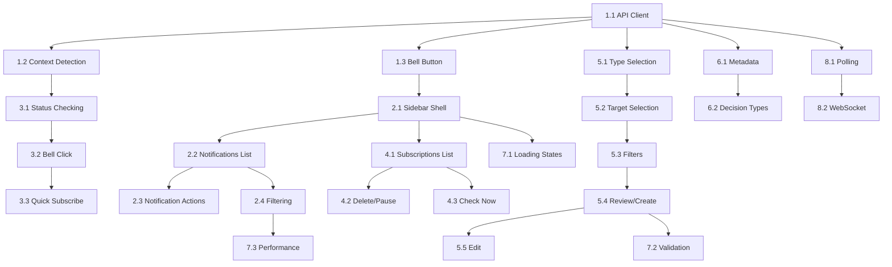

# Notification System Implementation Task Index

## Overview

This directory contains individual task specifications for implementing the notification system frontend. Each task is designed to be independently testable and has clear acceptance criteria.

## Implementation Order

### Phase 1: Foundation & Infrastructure (Weeks 1-2)
- [Task 1.1: API Client & Type Definitions](./phase-1/task-1.1-api-client-types.md)
- [Task 1.2: Context Detection System](./phase-1/task-1.2-context-detection.md)
- [Task 1.3: Basic Bell Button Component](./phase-1/task-1.3-bell-button-component.md)

### Phase 2: Notification Center Sidebar (Weeks 2-3)
- [Task 2.1: Sidebar Shell & Tab Navigation](./phase-2/task-2.1-sidebar-shell.md)
- [Task 2.2: Notifications List (Read-Only)](./phase-2/task-2.2-notifications-list.md)
- [Task 2.3: Notification Actions](./phase-2/task-2.3-notification-actions.md)
- [Task 2.4: Notification Filtering & Search](./phase-2/task-2.4-filtering-search.md)

### Phase 3: Context-Aware Bell Behavior (Week 4)
- [Task 3.1: Subscription Status Checking](./phase-3/task-3.1-subscription-status.md)
- [Task 3.2: Bell Click Context Behavior](./phase-3/task-3.2-bell-click-behavior.md)
- [Task 3.3: Quick Subscribe Flow](./phase-3/task-3.3-quick-subscribe.md)

### Phase 4: Subscription Management (Week 5)
- [Task 4.1: Subscriptions List (Read-Only)](./phase-4/task-4.1-subscriptions-list.md)
- [Task 4.2: Delete & Pause Subscriptions](./phase-4/task-4.2-delete-pause.md)
- [Task 4.3: Manual Check Now Action](./phase-4/task-4.3-check-now.md)

### Phase 5: Subscription Creation Wizard (Weeks 6-7)
- [Task 5.1: Type Selection Step](./phase-5/task-5.1-type-selection.md)
- [Task 5.2: Target Selection Step](./phase-5/task-5.2-target-selection.md)
- [Task 5.3: Filters Step](./phase-5/task-5.3-filters-step.md)
- [Task 5.4: Review & Name Step](./phase-5/task-5.4-review-create.md)
- [Task 5.5: Edit Subscription Flow](./phase-5/task-5.5-edit-subscription.md)

### Phase 6: Metadata & Decision Types (Week 8)
- [Task 6.1: Metadata Fetching & Caching](./phase-6/task-6.1-metadata-cache.md)
- [Task 6.2: Decision Type Selector](./phase-6/task-6.2-decision-type-selector.md)

### Phase 7: Polish & Edge Cases (Week 9)
- [Task 7.1: Loading & Error States](./phase-7/task-7.1-loading-error-states.md)
- [Task 7.2: Validation & Error Display](./phase-7/task-7.2-validation-errors.md)
- [Task 7.3: Performance Optimization](./phase-7/task-7.3-performance.md)

### Phase 8: Real-time Updates (Week 10 - Optional)
- [Task 8.1: Polling Implementation](./phase-8/task-8.1-polling.md)
- [Task 8.2: WebSocket Integration](./phase-8/task-8.2-websocket.md)

## Priority Levels

- 🔴 **Critical (MVP)**: Must be completed for initial release
- 🟡 **High Priority**: Should be in initial release
- 🟢 **Medium Priority**: Nice to have, can be deferred
- 🔵 **Low Priority**: Future enhancement

## Dependencies

## Task File Format

Each task file contains:
1. **Task ID & Title**
2. **Priority Level**
3. **Estimated Effort**
4. **Description**
5. **Goals**
6. **Technical Requirements**
7. **Dependencies**
8. **Acceptance Criteria**
9. **Testing Requirements**
10. **Implementation Notes**
11. **Related Files**
12. **Definition of Done**

## Testing Strategy

- **Unit Tests**: All utility functions, hooks, and isolated components
- **Integration Tests**: User flows across multiple components
- **E2E Tests**: Critical paths through the entire system
- **Visual Tests**: Snapshot testing for UI components

## Progress Tracking

Mark tasks as:
- ⬜ Not Started
- 🟦 In Progress
- ✅ Complete
- 🚫 Blocked

Update the status in each individual task file.
