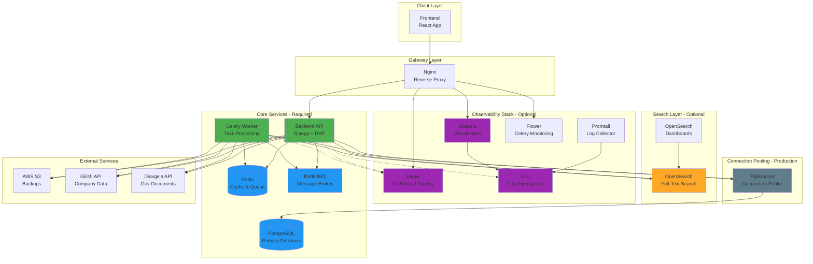

# Architecture Overview

## System Architecture

The Crati.Co platform is a modular, microservices-based application designed for processing and analyzing Greek government transparency documents. The architecture is composed of several independent layers that can be enabled or disabled based on your deployment needs.

## High-Level Architecture Diagram



## Architecture Layers

### 1. **Core Services** (Required)
These services form the essential backbone of the application and cannot be disabled:

- **Backend API (Django)**: REST API handling authentication, business logic, and data access
- **Celery Worker**: Asynchronous task processing for document ingestion, PDF extraction, and data processing
- **PostgreSQL**: Primary relational database with pgvector extension for vector embeddings
- **Redis**: In-memory cache and Celery result backend
- **RabbitMQ**: Message broker for Celery task queue
- **Nginx**: Reverse proxy and load balancer

### 2. **Search Layer** (Optional)
Full-text search capabilities using OpenSearch:

- **OpenSearch**: Elasticsearch-compatible search engine for document indexing
- **OpenSearch Dashboards**: UI for exploring search indices

**Control**: Set `INDEX_THE_OPENSEARCH=false` to disable OpenSearch integration

### 3. **Observability Stack** (Optional)
Monitoring, logging, and tracing infrastructure:

- **Jaeger**: Distributed tracing for performance monitoring and debugging
- **Loki**: Centralized log aggregation
- **Promtail**: Log collection agent that ships logs to Loki
- **Grafana**: Unified dashboard for logs, traces, and metrics
- **Flower**: Real-time Celery task monitoring

**Control**: 
- Set `TRANSMIT_TO_JAEGER=false` to disable distributed tracing
- Remove observability services from docker-compose for full disablement

### 4. **Connection Pooling** (Production Only)
- **PgBouncer**: PostgreSQL connection pooler to optimize database connections in production

### 5. **External Services**
- **AWS S3**: Backup storage
- **GEMI API**: Greek company registry data integration
- **Diavgeia API**: Greek government transparency portal

## Deployment Topologies

### Development (All-in-One)
```
docker-compose.yml - Full stack on single machine
```
All services including database, OpenSearch, and observability stack.

### Production (Separated)

#### Application Server
```
docker-compose.prod-no-db.yml
```
- Frontend, Backend, Workers
- Redis, RabbitMQ, PgBouncer
- Observability stack
- Connects to remote DB and OpenSearch

#### Database Server
```
docker-compose.prod-only-db.yml (not shown but implied)
```
- PostgreSQL with pgvector

#### Search Server
```
docker-compose.prod-only-opensearch.yml
```
- OpenSearch cluster
- OpenSearch Dashboards

## Data Flow

### 1. Document Ingestion Flow
```
Diavgeia API → Worker → PostgreSQL → (Optional) OpenSearch
                  ↓
              PDF Storage (S3)
                  ↓
              Text Extraction
                  ↓
              PostgreSQL + Vector Embeddings
```

### 2. User Request Flow
```
React App → Nginx → Django API → PostgreSQL
                                → (Optional) OpenSearch
                                → Redis (cache)
```

### 3. Background Processing Flow
```
Django API → RabbitMQ → Celery Worker → PostgreSQL
                                       → External APIs
                                       → (Optional) OpenSearch
```

## Modularity & Feature Flags

The architecture is designed to be highly modular. Key feature flags:

| Environment Variable | Default | Purpose |
|---------------------|---------|---------|
| `INDEX_THE_OPENSEARCH` | `true` | Enable/disable OpenSearch indexing |
| `TRANSMIT_TO_JAEGER` | `true` | Enable/disable distributed tracing |
| `EXTRACT_THE_DOCS_FROM_PDFS` | `true` | Enable/disable PDF text extraction |
| `HAVE_AFM_FETCH_JOB` | `true` | Enable/disable company data fetching |
| `LIGHT_WORKER` | `false` | Use lightweight worker without PDF dependencies |
| `STEALTH_MODE` | `false` | Enable authentication/authorization |
| `DEBUG` | `false` | Django debug mode |

See [Environment Variables Reference](./ENVIRONMENT_VARIABLES.md) for complete list.

## Technology Stack

### Backend
- **Python 3.11+** with Django 4.2+
- **Django REST Framework** for API
- **Celery** for async task processing
- **Poetry** for dependency management
- **Psycopg2** for PostgreSQL connectivity

### Frontend
- **React 18** with modern hooks
- **Clerk** for authentication
- **Axios** for API communication

### Infrastructure
- **Docker** & **Docker Compose** for containerization
- **Nginx** for reverse proxy
- **PostgreSQL 17** with pgvector extension
- **Redis 8.0** for caching
- **RabbitMQ 3.12** for message queue

### Observability
- **OpenTelemetry** for instrumentation
- **Jaeger** for tracing
- **Grafana** for visualization
- **Loki** for log aggregation

### Search
- **OpenSearch 3.0** for full-text search
- **pgvector** for semantic search

## Security Considerations

- **Basic Authentication** protecting administrative interfaces (Flower, Grafana, etc.)
- **JWT Authentication** via Clerk for API access
- **Network Isolation** using Docker networks
- **Environment-based Secrets** management
- **Read-only volumes** in production where applicable
- **Connection pooling** to prevent connection exhaustion attacks

## Scalability

### Horizontal Scaling Options
- **Multiple Workers**: Scale Celery workers independently
- **Database Read Replicas**: Add PostgreSQL read replicas through PgBouncer
- **OpenSearch Cluster**: Multi-node OpenSearch deployment
- **Nginx Load Balancing**: Multiple backend/frontend instances

### Vertical Scaling Levers
- `CELERY_CONCURRENCY`: Control worker parallelism
- `CELERY_WORKER_MAX_MEMORY_PER_CHILD`: Memory limits
- `OPENSEARCH_JAVA_OPTS`: JVM heap sizing
- PgBouncer pool sizes

## Next Steps

- [Component Details](./components/) - Deep dive into each service
- [Environment Variables](./ENVIRONMENT_VARIABLES.md) - Complete configuration reference
- [Deployment Guide](./DEPLOYMENT.md) - Step-by-step deployment instructions
- [Development Setup](./DEVELOPMENT.md) - Local development environment setup
