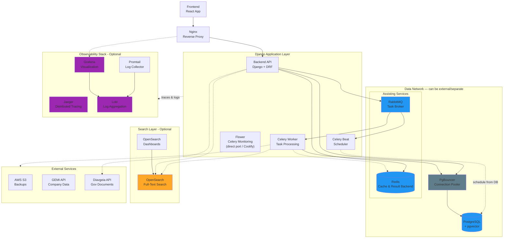

# Architecture Overview

## System Architecture

The Crati.Co platform is a modular, microservices-based application designed for processing and analyzing Greek government transparency documents. The architecture is composed of several independent layers that can be enabled or disabled based on your deployment needs.

## High-Level Architecture Diagram



## Architecture Layers

### 1. **Core Services** (Required)
These services form the essential backbone of the application and cannot be disabled:

- **Backend API (Django)**: REST API handling authentication, business logic, and data access
- **Celery Worker**: Asynchronous task processing for document ingestion, PDF extraction, and data processing
- **Celery Beat**: Scheduled task dispatcher — publishes periodic tasks via the broker and reads its schedule from the database
- **Flower**: Real-time Celery task monitoring (part of the Celery constellation; see [Admin UI Access](#admin-ui-access))
- **Nginx**: Reverse proxy and load balancer for the application traffic

### 2. **Data Network** (Required in dev, externalizable in prod)
Stateful services bundled with the stack in development, but designed to be split out and run externally in production (see the `prod-no-db` topology):

- **PostgreSQL**: Primary relational database with pgvector extension for vector embeddings
- **Redis**: In-memory cache and Celery result backend (used by both the API and the worker)
- **RabbitMQ**: Message broker connecting the API to the worker and beat
- **PgBouncer**: PostgreSQL connection pooler — sits between the Django apps and the database (production only)

### 2. **Search Layer** (Optional)
Full-text search capabilities using OpenSearch:

- **OpenSearch**: Elasticsearch-compatible search engine for document indexing
- **OpenSearch Dashboards**: UI for exploring search indices

**Control**: Set `INDEX_THE_OPENSEARCH=false` to disable OpenSearch integration

### 3. **Observability Stack** (Optional)
Monitoring, logging, and tracing infrastructure:

- **Jaeger**: Distributed tracing for performance monitoring and debugging
- **Loki**: Centralized log aggregation
- **Promtail**: Log collection agent that ships logs to Loki
- **Grafana**: Unified dashboard for logs, traces, and metrics

**Control**:
- Set `TRANSMIT_TO_JAEGER=false` to disable distributed tracing
- Remove observability services from docker-compose for full disablement

### 4. **Search Layer** (Optional)
Full-text search capabilities using OpenSearch:

- **OpenSearch**: Elasticsearch-compatible search engine for document indexing
- **OpenSearch Dashboards**: UI for exploring search indices

### 5. **External Services**
- **AWS S3**: Backup storage
- **GEMI API**: Greek company registry data integration
- **Diavgeia API**: Greek government transparency portal

### Admin UI Access

Nginx proxies **application traffic only** (frontend, API, Django admin, static assets).
The administrative/observability UIs — Grafana, Flower, and RabbitMQ's management
interface — are **not** served through Nginx:

- Grafana's media/assets don't work reliably behind the app's reverse proxy
  (it's designed for its own root path), so its Nginx location is intentionally
  omitted.
- Flower's proxy location is commented out in `nginx/default.conf` for the same
  reason (see the service communication table in [Component Details](./components/)).

Instead, these UIs are reached in one of two ways:

1. **Direct host port** (development/staging): e.g. `http://<host>:3001` for
   Grafana, `http://<host>:5555` for Flower, `http://<host>:15672` for RabbitMQ
   Management.
2. **Coolify** (production): these services are attached to dedicated domains
   and proxied by [Coolify](https://coolify.io) — an open-source Heroku
   alternative — which handles TLS termination and reverse proxying for each
   subdomain (e.g. `grafana.example.com`, `flower.example.com`).

In both cases the UIs remain protected by their own basic authentication
(`FLOWER_BASIC_AUTH`, `GRAFANA_ADMIN_PASSWORD`, RabbitMQ credentials).

## Deployment Topologies

### Development (All-in-One)
```
docker-compose.yml - Full stack on single machine
```
All services including database, OpenSearch, and observability stack.

### Production

#### Single-Server Production
```
docker-compose.prod.yml
```
- All services on one server (suitable for small/medium deployments)
- Frontend, Backend, Workers
- PostgreSQL with pgvector
- Redis, RabbitMQ
- Observability stack

#### Multi-Server Production
```
docker-compose.prod-no-db.yml
```
- Application server with frontend, backend, workers
- Redis, RabbitMQ, PgBouncer
- Observability stack
- Connects to external PostgreSQL and OpenSearch instances
- **Note**: External database and search services must be configured separately

## Data Flow

### 1. Document Ingestion Flow
```
Diavgeia API → Worker → PostgreSQL → (Optional) OpenSearch
                  ↓
              PDF Storage (Ephemeral Storage) - S3 Not Available yet
                  ↓
              Text Extraction
                  ↓
              PostgreSQL (+ placeholder for Vector Embeddings included in data modelling)
```

### 2. User Request Flow
```
React App → Nginx → Django API → PostgreSQL
                                → (Optional) OpenSearch
                                → Redis (cache)
```

### 3. Background Processing Flow
```
Django API → RabbitMQ → Celery Worker → PostgreSQL
                                       → External APIs
                                       → (Optional) OpenSearch
```

## Modularity & Feature Flags

The architecture is designed to be highly modular. Flags most relevant to the architecture:

| Environment Variable | Default | Purpose |
|---------------------|---------|---------|
| `INDEX_THE_OPENSEARCH` | `true` | Enable/disable OpenSearch indexing |
| `TRANSMIT_TO_JAEGER` | `false` | Enable/disable distributed tracing (requires service restart) |
| `EXTRACT_THE_DOCS_FROM_PDFS` | `true` | Enable/disable PDF text extraction |
| `HAVE_AFM_FETCH_JOB` | `true` | Enable/disable company data fetching |
| `LIGHT_WORKER` | `false` | Use lightweight worker without PDF dependencies |
| `STEALTH_MODE` | `false` | Enable authentication/authorization |
| `DEBUG` | `false` | Django debug mode |

> **Single source of truth:** the full list of flags (with descriptions, defaults and
> categories) lives in `KNOWN_FLAGS` in
> [`backend/core/services/feature_flag_service.py`](../../backend/core/services/feature_flag_service.py).

See [Environment Variables Reference](./ENVIRONMENT_VARIABLES.md) for complete list.

## Technology Stack

### Backend
- **Python 3.11+** with Django 4.2+
- **Django REST Framework** for API
- **Celery** for async task processing
- **Poetry** for dependency management
- **Psycopg2** for PostgreSQL connectivity

### Frontend
- **React 18** with modern hooks
- **Clerk** for authentication
- **Axios** for API communication

### Infrastructure
- **Docker** & **Docker Compose** for containerization
- **Nginx** for reverse proxy
- **PostgreSQL 17** with pgvector extension
- **Redis 8.0** for caching
- **RabbitMQ 3.12** for message queue

### Observability
- **OpenTelemetry** for instrumentation
- **Jaeger** for tracing
- **Grafana** for visualization
- **Loki** for log aggregation

### Search
- **OpenSearch 3.0** for full-text search
- **pgvector** for semantic search

## Security Considerations

- **Basic Authentication** protecting administrative interfaces (Flower, Grafana, etc.)
- **JWT Authentication** via Clerk for API access
- **Network Isolation** using Docker networks
- **Environment-based Secrets** management
- **Read-only volumes** in production where applicable
- **Connection pooling** to prevent connection exhaustion attacks

## Scalability

### Horizontal Scaling Options
- **Multiple Workers**: Scale Celery workers independently
- **Database Read Replicas**: Add PostgreSQL read replicas through PgBouncer
- **OpenSearch Cluster**: Multi-node OpenSearch deployment
- **Nginx Load Balancing**: Multiple backend/frontend instances

### Vertical Scaling Levers
- `CELERY_CONCURRENCY`: Control worker parallelism
- `CELERY_WORKER_MAX_MEMORY_PER_CHILD`: Memory limits
- `OPENSEARCH_JAVA_OPTS`: JVM heap sizing
- PgBouncer pool sizes

## Next Steps

- [Component Details](./components/) - Deep dive into each service
- [Environment Variables](./ENVIRONMENT_VARIABLES.md) - Complete configuration reference
- [Deployment Guide](./DEPLOYMENT.md) - Step-by-step deployment instructions
- [Contributing & Development](../../CONTRIBUTING.md) - Local development setup and workflow
