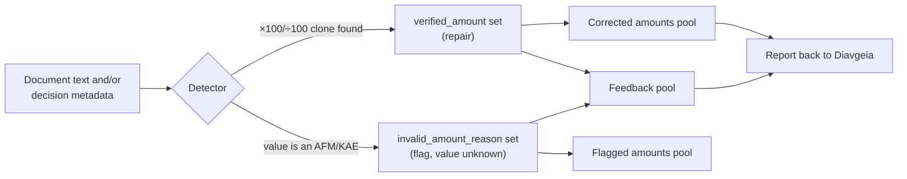
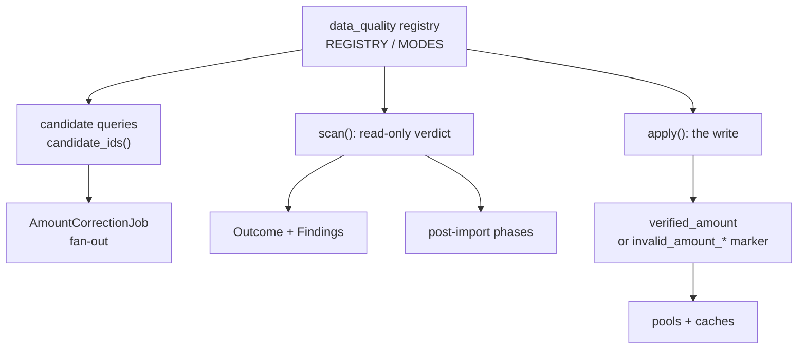
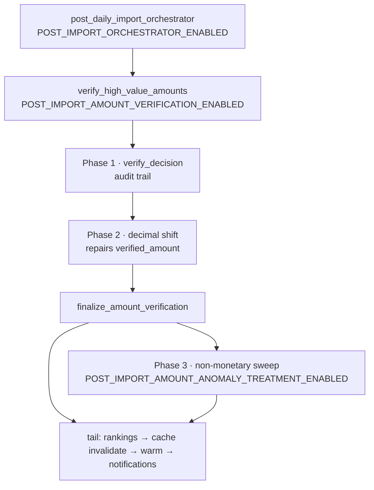

# Data Quality — Detecting and Repairing Wrong Amounts

This document describes how Crati finds and handles **wrong monetary values** in
ingested Diavgeia decisions: 
1) the detectors that exist today, 
2) the framework that every future detector plugs into, 
3) how to operate it (admin and CLI), 
4) and what is still duplicated.

It is a living document. **Adding a new detector means updating this file** —
§6 has the recipe.

Wherever behaviour is covered by an automated test, the test is named.

---

## 1. The problem

Diavgeia publishes decisions as **structured metadata** plus a **PDF**. 

Editors **mistype numbers**, and the metadata occasionally holds a value that is not a monetary
amount at all. 

Two such mistakes are known today.

### 1.1 A dropped decimal comma makes an amount 100× too big

| | |
|---|---|
| The document says | `30.000,00` (€30,000.00) |
| The metadata says | `expenseAmount = 3000000` (€3,000,000.00) |
| What went wrong | the decimal comma was dropped when typing |

The recorded value is exactly the amount written in the text **× 100** (a ÷ 100
shift also occurs). Because the number carries cents in the document, the match
is unambiguous.

### 1.2 A different field's value ends up in the amount

The amount field holds a value that belongs to a *different* numeric field of the
same decision — usually the counterpart's **AFM** (VAT number / ΑΦΜ) or a budget
**KAE** code (ΚΑΕ). The value is *misplaced*, not duplicated.

| ADA | recorded `expenseAmount` | what the value really is |
|---|---|---|
| `Ψ0Α74690Β9-52Ρ` | €99,370,337 | counterpart VAT number `099370337` |
| `ΨΛΘΒΟΡΡ2-ΖΤΞ` | €801,380,053 | counterpart VAT number `801380053` |
| `ΨΡΙ0Ω12-0ΙΘ` | €706,273,001 | sibling `kae` = `70.6273.001` |

Here the **real amount is unknown**. Any number we write would be a fabrication.

### 1.3 Why it matters

These values flow into amount filters, rankings, pre-calculated statistics and
cached totals. A €3M decision that is really €30k distorts every list it appears
in — and a VAT number counted as €99M distorts them spectacularly.

---

## 2. What happens to a decision once a detector finds it



Three admin pools make the state visible:

| Pool | URL (`/admin/core/decision/…`) | Contains |
|---|---|---|
| Corrected amounts | `corrected-amounts-pool/` | decisions with a repaired `verified_amount` |
| Flagged amounts | `flagged-amounts-pool/` | decisions whose amount was flagged unusable |
| Feedback pool | `feedback-pool/` | **either** of the above, minus those already reported back to Diavgeia |

The feedback pool is the operator's worklist: it answers "which decisions do we
know are wrong, and have we told Diavgeia yet?".

---

## 3. What gets written, and the invariant

Two different target columns, chosen by whether the real amount is recoverable:

| | `verified_amount` | `invalid_amount_reason` / `_value` / `_flagged_at` |
|---|---|---|
| Used when | the text proves the correct value | the value is not a monetary amount at all |
| Meaning | "this is the amount" | "this amount is unusable, real value unknown" |
| Read by | `COALESCE(verified_amount, amount)` everywhere | the facet layer, which **excludes** the row |
| Rollback | `clear_verified_amounts` admin action | `fix_amount_anomalies --clear` |

**The invariant: a detector never invents a monetary value.**

- Writing `verified_amount = 0` for the AFM case would falsely assert a value of
  €0 — and it would still be summed.
- `COALESCE(verified_amount, amount)` alone cannot exclude a bogus amount: the
  wrong `amount` would win the `COALESCE`. That is precisely why the marker
  exists as a separate column (see `lessons_learnt/non_monetary_value_as_amount.md`).

---

## 4. Detector 1 — decimal separator shift

| | |
|---|---|
| `mode` | `decimal_shift` |
| Slug | `decimal-shift` |
| Needs the document | **yes** (download + extract) |
| Can repair | **yes** |
| Typical cost | one PDF read per unextracted candidate |

### How it decides

It compares only amounts that carry **two decimals**, because Greek official
documents write money as `1.234.567,89`. A 2-decimal match cannot occur by
coincidence — a round number could, a number with cents cannot.

For each `DecisionAmountField` of the decision:

1. the value appears **verbatim** in the text → already correct, nothing to do;
2. otherwise a **×100 / ÷100 clone** appears → mis-typed, this is a correction;
3. otherwise → the value is simply not found (a different problem; the
   verification step records it, this detector abstains).

### Worked example — single field

```
document text   … η δαπάνη ανέρχεται σε 30.000,00 € …
metadata        expenseAmount = 3000000.00

text  = metadata ÷ 100          →  clone factor 0.01
result                          →  verified_amount = 30000.00
```

After the run, every consumer reads `COALESCE(verified_amount, amount)`, so the
corrected value overrides the metadata everywhere at once — no model bloat and no
change to the imported payload.

### Worked example — group correction

Sometimes *every* field was mistyped, so no individual value matches but the
**total** does:

```
metadata   30.000.000,00  +  5.000.000,00   = 35.000.000,00
document   30.000,00      +  5.000,00       = 30.005,00   ← total has a ÷100 clone
```

Each field is re-scaled proportionally and the last field absorbs the rounding
remainder so the corrected total equals the text amount exactly. The implied
ratio must land in `[99, 101]`; anything else is rejected as a data problem
rather than a typo, and logged as a warning.

### Bounds and idempotency

- Minimum amount: **€100,000** (`DEFAULT_CORRECTION_THRESHOLD`), applied to the
  decision's *computed total*.
- A decision is a candidate only while it still has an amount field with no
  `verified_amount` **and** no `invalid_amount_reason` — so a row that can never
  be repaired is not re-selected on every run
  (`test_amount_correction_tasks.py`).
- Re-running the detector is safe: it recomputes the same correction and writes
  the same value.

---

## 5. Detector 2 — non-monetary value recorded as amount

| | |
|---|---|
| `mode` | `non_monetary` |
| Slug | `non-monetary-value` |
| Needs the document | **no** — database only |
| Can repair | **no** — flags instead |
| Typical cost | no document reads; safe over the whole backlog |

### How it decides

It compares each recorded amount against the decision's **own** AFMs (counterpart
VAT numbers, taken from the entity relationships and the sponsor metadata) and
**KAEs** (budget classification codes, scanned recursively, digit-only, at least
6 digits).

The match is deliberately forgiving, because the value is stored as a number:
whole-euro, zero-cents, leading-zero insensitive, and it accepts the raw-span
format variants. When a KAE is stored *next to* the amount
(`DecisionAmountField.raw_context["kae"]`), the same-container match is used for
higher precision — that only runs when `raw_context` is already loaded, since a
deferred JSONField would trigger a query per row.

### Worked example

```
sponsor[0].sponsorAFMName.afm  = 099370337
sponsor[0].expenseAmount       = 99370337     ← 099370337 with leading zero dropped

→ flagged: invalid_amount_reason = "afm_as_amount"
           invalid_amount_value  = "099370337"
           verified_amount       = NULL        (we do not know the real amount)
```

The document itself shows this value *as an amount* (e.g. `99.370.337,00`), which
is why a text-based check cannot catch it — the mistake happened upstream, in the
data Diavgeia hands over.

### Consequences of flagging

- The row leaves every monetary aggregation (filters, rankings, pre-calc,
  statistics) via the facet layer.
- The decision appears in the **flagged pool** and the **feedback pool**, so the
  real amount can be looked up by hand and reported back to Diavgeia.
- The marker is idempotent, and `fix_amount_anomalies --clear` (or the
  *clear non-monetary markers* admin action) reverses it.

### Variant: the issuing org as its own counterpart (`self_as_counterpart`)

A structurally different case: the decision's **counterpart AFM equals the
issuing organization's own VAT number**. Here the amount itself may be
perfectly well-formed (e.g. €22,000) — what is broken is the *relationship*:
the intended counterpart is unknown. So this variant is **decision-level, not
an amount problem**: the amounts stay trusted (they count in every total), and
the counterpart issue is surfaced separately — recovering the real counterpart
is future work.

| ADA | org | org VAT (DB) | counterpart AFM on the decision | verdict |
|---|---|---|---|---|
| `6Ζ9Ν469ΗΣΥ-Μ6Χ` | ΙΦΕΤ Μ.Α.Ε. | `090064864` | `090064864` (person) | counterpart flagged at decision level — exact match |
| `945Ζ469ΗΣΥ-Λ2Ε` | ΙΦΕΤ Μ.Α.Ε. | `090064864` | `090064864` (person) | counterpart flagged at decision level — exact match |
| `6ΜΣΥ46906Ρ-ΑΞΡ` | Νοσοκομείο Παίδων | `09000980` (8 digits, **truncated**) | `090009802` (9 digits) | counterpart flagged at decision level — truncated-prefix match |

**The org VAT is not in the payload.** Real Diavgeia responses for these
decisions carry **no** `extraFieldValues.org` block — the issuing org's AFM
lives only in the `core_organization.vat_number` row. The detector therefore
reads it from the DB, exactly the join the analytics layer already uses:

```
DecisionEntityRelationship.entity.afm          (the counterpart)
        ==
Decision.organization.vat_number               (the issuing org, from the DB)
```

`collect_org_afm(decision)` reads `decision.organization.vat_number`;
`collect_self_counterparts(decision)` intersects it with the counterpart AFMs.
When the intersection is non-empty the decision carries the signal — it is
**not** written into `invalid_amount_reason` (that marker means "this value is
not money", which is false here). Instead:

- the decision detail API returns `has_self_counterpart` +
  `self_counterpart_afm` (the **full** counterpart AFM, e.g. `090009802`), and
  the detail page shows the amount normally with a counterpart warning;
- amount verification records a `[SELF-AS-COUNTERPART]` audit note
  (`TextProcessRun.meta["self_counterpart_afm"]`) without a discrepancy —
  the amount is confirmed as usual when the text matches;
- legacy markers written by the earlier treatment are cleared by migration
  `0100_clear_self_counterpart_amount_markers`.

**Where the counterpart AFMs come from.** Diavgeia has *no validation*: a
counterpart AFM can appear under `sponsor`, `person`, `grantee`, `grantor`,
`donationGiver`, `employerOrg`, `primaryOfficer`, and more — and the *type* is
routinely mislabelled (a company marked `person`, a hospital marked
`unknown`). So `collect_counterpart_afms` does not trust any single container:
it harvests every `afm` value found under any known counterpart container of
`extra_field_values_json` (recursively), unioned with the extracted
`DecisionEntityRelationship` rows. The `org` block is deliberately excluded —
that is the issuer, not a counterpart.

**The match is exact *or* truncated-prefix.** Two modes (`_is_self_counterpart`):

- **exact** — the common case: a 9-digit VAT equals a 9-digit counterpart AFM.
- **truncated prefix** — the org VAT was recorded *short*. Παίδων's DB VAT is
  the 8-digit `09000980`; the real counterpart AFM on its decisions is the
  9-digit `090009802`. The counterpart is a self-reference when it **starts
  with** the org VAT. Verified against prod: the `09000980` prefix matches
  exactly one distinct AFM (`090009802`) — the org's own name — across
  **14,534 decisions**. The signal is unambiguous in practice.

Two guards keep the prefix match surgical:

1. **≥ 8 digits.** A shorter VAT is junk (`011`, `-`), and an N-digit prefix
   matches up to 10^(9−N) distinct 9-digit AFMs — far too ambiguous.
2. **No placeholder VATs.** All-same-digit VATs (`00000000`, `999999999`) are
   filler, never a real AFM. Org `54566`'s `00000000` would otherwise
   prefix-match every `00000000X` counterpart (3 distinct AFMs on prod).
   `_is_plausible_org_vat` rejects any all-same-digit value, treating it as
   absent.

The reported counterpart is always the **full counterpart AFM**
(`090009802`), so the audit trail shows the real counterpart, not the
truncated VAT.

### Efficiency: daily batch vs. historical backfill

The detector is **DB-only** (`needs_text = False`) — no document reads — so it
is cheap enough to run over the whole backlog. The two operating modes:

- **Daily ingested batch** — post-import Phase 3
  (`tasks_post_import._discover_non_monetary_values`) runs the detector over
  just the decisions imported that day. The candidate set is tiny. Gated by
  `POST_IMPORT_ORCHESTRATOR_ENABLED` +
  `POST_IMPORT_AMOUNT_VERIFICATION_ENABLED`; treatment (writing the marker) by
  `POST_IMPORT_AMOUNT_ANOMALY_TREATMENT_ENABLED`.

- **Historical backfill** — `find_amount_anomalies` / `fix_amount_anomalies`
  (and the admin batch view) sweep already-ingested decisions through the
  amount-bounded candidate query:

  ```sql
  ... WHERE amount >= min AND amount < max   -- AFM/KAE value bounds
  ```

  `--limit` is pushed into the SQL (`.distinct()[:limit]`), so a bounded run
  never materialises the whole candidate set. Because a mis-recorded AFM/KAE
  is an 8-9 digit number, the bounds are what keep the sweep tractable.

The self-counterpart signal is deliberately **not** part of the sweep: it has
no amount-level treatment (the amounts stay valid), so there is nothing for
the candidate query to select it *for*. It is computed per decision — at
verification time (the audit note) and at detail time (the API fields) — via
`collect_self_counterparts`, which costs one relationship scan + one org read.

### Extending the kinds

A new *kind* of misplaced value is: a collector + a `KIND_*` + a reason constant
in `core/services/non_monetary_value_guard.py`, plus one ground-truth case file.
The marker vocabulary is the extension point; the scope is open by design.

---

## 6. The detector framework

Detectors are registered, not hard-coded. The batch job, the post-import sweep
and the admin all ask the registry which detectors to run, so adding a detector
never requires touching a task or a template.

### Files

| File | Role |
|---|---|
| `core/services/data_quality/base.py` | `Finding`, `Outcome`, `BaseDetector`, `run_detectors()`, `summarize()` |
| `core/services/data_quality/__init__.py` | the registry: `REGISTRY`, `MODES`, `register()`, `get_detector()`, `resolve_detectors()`, `resolve_mode_bounds()`, `describe_detectors()` |
| `core/services/data_quality/decimal_shift.py` | detector 1 |
| `core/services/data_quality/non_monetary.py` | detector 2 |
| `core/models/amount_correction_job.py` | `AmountCorrectionJob.mode` picks the detector(s) |
| `core/tasks/tasks_amount_correction.py` | batch fan-out; resolves candidates through the registry |
| `core/tasks/tasks_post_import.py` | post-import Phase 2 (repair) and Phase 3 (flag) |

A **detector** is not a text process. `core/services/text_processes` answers
*"does this text contain X?"* (pure, reusable, no verdict). A detector answers
*"does this decision's recorded data disagree with the source?"* and owns a
verdict, a candidate query and a treatment. A detector may *use* text processes —
detector 1 uses the cents-based amount detector — but a text process never flags
a decision.

### The five seams



### The contract

```python
class MyDetector(BaseDetector):
    slug = "my-detector"          # stable id in job results and CLI output
    mode_key = "my_detector"      # must be a key of MODES
    name = "Human name"
    description = "One sentence: what is wrong and how it is recognisable."
    note_marker = "[MY-THING]"    # greppable tag prefixed to notes

    needs_text = False            # True → a run will download documents
    can_repair = False            # False → may only flag, never write money
    uses_total_amount = False     # do the amount bounds mean the total or a field?
    default_min_amount = Decimal("100000")
    default_max_amount = None

    def candidate_ids(self, *, min_amount=None, max_amount=None,
                      imported_since=None, imported_until=None,
                      issue_start=None, issue_end=None, limit=None) -> list[int]:
        ...   # the ONLY definition of "which decisions can this act on"

    def scan(self, decision, **kwargs) -> Outcome:
        ...   # read-only; returns Findings

    def apply(self, decision, outcome, **kwargs) -> int:
        ...   # writes; returns rows written; delegates to a service
```

### The rules

1. **Detect and treat are separate.** `scan()` never writes a verdict. It may
   persist the extracted document text — that is a cache, not a decision.
2. **Never invent a monetary value.** Unknown amount → flag the row (§3).
3. **Own your candidate query.** The batch job, the post-import sweep and the CLI
   all call `candidate_ids()`. Never re-write the filter next to a caller.
4. **Declare your inputs.** `needs_text` tells the operator whether a run will
   download documents; the admin form and the doc rely on it.
5. **Declare your amount bounds**, and say what they bound
   (`uses_total_amount`). Misrecorded values are numerically ambiguous, so bounds
   are what keep a historical sweep tractable.
6. **Be idempotent.** Re-running `apply()` on a treated row is a no-op or
   rewrites the identical value.
7. **Delegate writes.** `apply()` calls the owning service
   (`AmountCorrectionService`) so there is one write path per verdict. The price
   is that `apply()` re-derives the plan `scan()` produced — cheap, because
   `scan()` already persisted the extracted text (no second download).
8. **Prove it.** Add a ground-truth case (§10). A detector with no case is a guess.

### Adding a detector — the recipe

1. **Write the class** in `core/services/data_quality/<name>.py`.
2. **Register it** at the bottom of `data_quality/__init__.py` and add its
   `mode_key` to `MODES`. Registration fails loudly on a duplicate slug or an
   undeclared mode, so a typo cannot silently correct nothing
   (`test_data_quality_registry.py`).
3. **Add the mode to `CorrectionJobMode`** in
   `core/models/amount_correction_job.py`, so the admin form offers it. A test
   asserts the model, the registry and the form agree.
4. **Add a ground-truth case** (§10) and run
   `pytest core/tests/services/test_data_quality_registry.py`.

No task, admin view, CLI or template change is required.
`describe_detectors()` is the machine-readable catalogue (slug, mode,
`needs_text`, `can_repair`, bounds) for a future API or UI listing.

---

## 7. Running automatically after each import



| Phase | Detector | Writes? |
|---|---|---|
| 1 | — (`verify_decision`: `TextProcessRun` + `TextProcessResolution`) | the resolution |
| 2 | decimal shift | **repairs** `verified_amount` |
| 3 | non-monetary value | reports always; **flags** only when the treatment flag is on |

The tail runs last **by design**: amount correction is the only step that mutates
monetary values, and the steps that read amounts (entity rankings, statistics
snapshots, cache warming) must see the corrected figures.

### Flags

| Flag | Default | Effect |
|---|---|---|
| `POST_IMPORT_ORCHESTRATOR_ENABLED` | **off** | master switch; with it off, nothing below runs |
| `POST_IMPORT_AMOUNT_VERIFICATION_ENABLED` | on | runs Phases 1–3 |
| `POST_IMPORT_AMOUNT_ANOMALY_TREATMENT_ENABLED` | **off** | Phase 3 *writes* the marker; off = report only |

With the master flag off there is no discovery logging at all — "I see no
anomaly logs" almost always means the orchestrator flag is off, or no global
daily import has run.

### Scope

Both phases filter on `Decision.created_at` — **import** time, not issue date —
over `[reference_date 00:00, +1 day)`. A run therefore never fans out over the
historical backlog. To backfill a specific import day, pass the date:

```python
verify_high_value_amounts(reference_date_str="2026-05-29")
```

### One hazard

⚠️ **Do not enable the `daily_amount_correction` beat job while post-import
Phase 2 is on.** They cover the same decisions; the beat job re-runs the whole
correction over the last 2 days of imports and re-downloads documents for
anything Phase 2 missed. Keep exactly one of them.

---

## 8. Operating it — admin

**Admin → Decisions → “Batch Data-Quality Job”**
(`/admin/core/decision/batch-correct-amounts/`).

| Field | What it does |
|---|---|
| **Mode** | `decimal_shift` / `non_monetary` / `both` — which detector(s) run |
| **Minimum amount (€)** | the *computed total* for decimal shift, the *individual recorded amount* for non-monetary |
| **Maximum amount (€)** | optional upper bound, same target as the minimum → scan a band |
| **Start / End date** | filter on issue date |
| **Limit** | cap on decisions (default 500) |
| **Dry run** | plan only, write nothing — always do this first |
| **Read if missing** | uncheck to skip documents that were never extracted (ignored by DB-only detectors) |

Submitting creates an `AmountCorrectionJob` and dispatches
`run_amount_correction_job` to a Celery worker. The job page
(`/admin/core/decision/correction-job/<job_id>/`) refreshes itself and shows, per
decision, the corrections (`<field>: €3,000,000.00 → €30,000.00 [decimal-shift]`)
and the flagged values (`<field>: €99,370,337 = AFM 099370337 [non-monetary-value]`).

**Recommended order of operations for a backlog sweep**

1. `Mode = both`, `Dry run = ✅`, `Limit = 500` → look at what would change.
2. Re-run for real with `Dry run = ❌`.
3. Raise `Limit` in steps. Leave the amount fields empty for no bounds (the
   heavy case — see §9).
4. When finished, check the **feedback pool** and report the affected decisions
   back to Diavgeia.

Because the two detectors answer different questions, a useful split is:
`non_monetary` over everything (it costs no document reads), and
`decimal_shift` only where the amounts are large enough to matter.

### CLI equivalents

`find_amount_anomalies` (read-only report) and `fix_amount_anomalies` (treatment,
dry-run by default) cover detector 2 without the admin. Both accept
`--kind afm|kae|all`, `--min-amount/--max-amount`, `--imported-since/--imported-until`
and `--limit`; `fix_` additionally takes `--apply` and `--clear`.

```bash
# what would be flagged? (writes nothing)
python manage.py find_amount_anomalies --kind all --limit 500 --output anomalies.json

# flag them (dry-run first, then --apply)
python manage.py fix_amount_anomalies --limit 500
python manage.py fix_amount_anomalies --apply --limit 500

# undo
python manage.py fix_amount_anomalies --clear --apply --kind afm
```

The `--output` JSON has the shape
`{generated_at, kind, scanned_decisions, hit_count, anomaly_count, hits[…]}`,
where each hit carries the decision (ADA, subject, amount bounds used) and an
`anomalies[]` list with the field, the recorded value, the matched AFM/KAE and a
few sibling amounts as hints for the real value.

---

## 9. Performance rules for any sweep

Learned the hard way — see `lessons_learnt/runaway_query_lock_pileup.md`.

1. **Never `.count()` an un-sliced aggregate queryset.** The candidate query is
   `annotate(amount_sum_excluding_kae())` + `GROUP BY` + `HAVING`; counting it
   runs the whole thing wrapped in `SELECT COUNT(*) FROM (…)`. That is the shape
   that produced a runaway query and a cluster-wide lock pileup. Slice first, or
   derive the count from the already-limited list — the batch job does the latter.
2. **Scale in the right column.** `Decision.created_at` has a B-tree index for
   `imported_since/until`; use `created_at`, never `updated_at` (which the
   correction itself mutates).
3. **Pass ids, not date ranges, to child tasks** — a range would re-run the heavy
   aggregate once per child.
4. **Bound every ad-hoc scan** (`limit`, `--min-amount`) and prefer a DB-only
   detector when you only need to know *whether* something is wrong.

---

## 10. Caches and tests

**Caches.** Repairing or flagging a value changes every amount-derived view:

- batch job: invalidated on completion when `corrected` or `flagged` is non-zero;
- post-import: `finalize_amount_verification` clears `top_`, `da_top_pairs`,
  `explore_orgs` (Phase 3 flags included);
- admin single actions: `_invalidate_flag_caches()`.

Cache **warming is not a substitute** for invalidation: the warm step repopulates
only the exact keys it knows, so other ranges and offsets keep serving stale
amounts until their TTL expires.

**Tests** (`backend/core/tests/`):

| File | What it pins |
|---|---|
| `services/test_data_quality_registry.py` | registry invariants; `run_detectors`/`summarize` for both detectors (`can_repair`, never-guess, idempotency, candidate bounds, per-detector failure isolation); model ↔ registry ↔ form agreement |
| `tasks/test_amount_correction_job_modes.py` | mode expansion, propagation to child tasks, no duplicate fan-out in `both`, unknown mode fails the job |
| `tasks/test_amount_correction_tasks.py` | a flagged row is never re-selected as “uncorrected” |
| `services/test_non_monetary_value_pipeline.py` | **data-driven** ground truth (below); self-as-counterpart payloads pinned as decision-level (amounts believed, no marker) |
| `services/test_non_monetary_value_guard.py` | guard primitives (synthetic) |
| `services/test_amount_verification_service.py` | `data/amount_text_patterns/*.json` regex cases |
| `services/test_grouped_amount_detection.py` | cents parsing and clone factors |
| `management/test_fix_amount_anomalies.py`, `management/test_flag_anomalies_admin.py` | CLI/admin contract: dry-run by default, exactly three marker columns, idempotent, `--clear` reverses, never touches `verified_amount` |
| `frontend/e2e/bad-amounts.spec.js` + `api/e2e_fixtures/bad_amounts.py` | **E2E**: the four display semantics on the decision detail page (corrected + badge, AFM invalid, KAE invalid, self-counterpart warning with the amount kept) — see §5 |

### Adding a ground-truth case (the highest-value test you can write)

Drop the raw `luminapi/api/decisions/<ADA>` JSON into
`backend/core/tests/data/non_monetary_value_cases/` — **zero code changes**. The
case is discovered automatically and run through the real chain (extraction →
verify → correct → guard). The expected anomalies are re-derived from the raw
payload by the test's own naive implementation, so the test cross-checks the
guard instead of restating it.

---

## 11. Known duplication — the follow-up list

These are real, currently-tolerated duplications. Fixing them is the natural next
step; please do not add a third copy.

1. **`_candidate_decisions` is duplicated verbatim** in
   `management/commands/find_amount_anomalies.py` and
   `fix_amount_anomalies.py` (both carry a “keep in sync” comment).
   `NonMonetaryValueDetector.candidate_ids()` expresses the same predicate; the
   commands should delegate to it.
2. **The feedback-pool query exists twice**:
   `DiavgeiaFeedbackService.pending_decisions()` and
   `tasks_diavgeia_feedback.run_feedback_job`. Any change to “what counts as wrong
   data” must be made in both.
3. **`AmountCorrectionService.correct_high_value_decisions()`** still builds its
   own candidate query; the batch job now goes through
   `DecimalShiftDetector.candidate_ids()`, and this method should follow.

---

## 12. Glossary

| Term | Meaning |
|---|---|
| **ADA** (`ΑΔΑ`) | the unique identifier Diavgeia assigns to a published decision |
| **AFM** (`ΑΦΜ`) | Greek tax number / VAT number of a person or company |
| **KAE** (`ΚΑΕ`) | budget classification code |
| **`DecisionAmountField`** | one monetary amount parsed out of a decision's metadata |
| **`verified_amount`** | a detector-confirmed corrected amount, overriding the raw `amount` |
| **invalid-amount marker** | `invalid_amount_reason` / `_value` / `_flagged_at` — “this amount is unusable” |
| **detector** | a registered algorithm that judges one recorded value and (optionally) treats it |
| **mode** | `AmountCorrectionJob.mode`: which detector(s) a batch run executes |

---

## See also

- `lessons_learnt/non_monetary_value_as_amount.md` — the AFM/KAE guard in depth (payloads, manual workflow).
- `lessons_learnt/runaway_query_lock_pileup.md` — why candidate queries must never be counted un-sliced.
- `lessons_learnt/admin_pool_view_lazy_query_hang.md` — the pool queries and their indexes.
- `en/ARCHITECTURE.md` — where this fits in the overall system.
