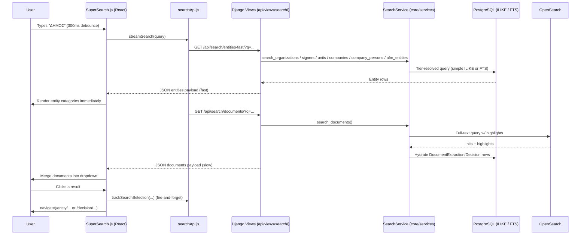

# Search — End-to-End Documentation

This document describes how search works in Crati, from the moment a user types
into the search box in the frontend to the database/OpenSearch queries in the
backend, and back. Wherever a behavior is covered by an automated test, the
test is referenced.

---

## 1. High-Level Architecture

Key design decision: **two-phase search**. Entities are fast (PostgreSQL only)
and are returned first; document content search is slow (OpenSearch, or
PostgreSQL FTS fallback) and is merged in when it completes. The frontend
shows entities immediately and displays a secondary spinner while documents
load.

---

## 2. Frontend

### 2.1 `SuperSearch` component — [frontend/src/components/SuperSearch.js](frontend/src/components/SuperSearch.js)

The single entry point for search-as-you-type UI.

**Typing flow** (`handleInputChange` → `performSearch`):

1. Every keystroke resets per-category limits (`categoryLimits`, all start at 5)
   and `hasMoreResults` flags.
2. Input is **debounced by 300 ms** via `setTimeout`.
3. `performSearch` aborts any in-flight request through an `AbortController`
   (`abortControllerRef`) so stale responses never overwrite newer ones.
4. Calls `streamSearch(query, { includeDocuments: showFullResults, limit: 5, ... })`
   from [frontend/src/api/searchApi.js](frontend/src/api/searchApi.js).

**Two-phase result handling** (callbacks passed to `streamSearch`):

- `onEntities(entityData)` — merges entity results into state, computes initial
  `hasMoreResults` per category (a category "has more" if it returned ≥ 5),
  auto-selects the first non-empty category tab, hides the main spinner and
  shows the "documents loading" spinner.
- `onDocuments(documentData)` — merges `results.documents` into the existing
  state and updates `total_count`.
- `onDone` / `onError` — spinner cleanup; on error, existing results are kept
  and an error payload is only shown if there were no results at all.

**Focus behavior** (`handleInputFocus`):

- If there is a non-empty query with cached results → just re-show them.
- If the input is empty → fetches in parallel:
  - `getDefaultSuggestions(10)` → `GET /api/search/suggestions/` (admin-curated
    popular entities),
  - `getRecentlyVisited(5, true)` → `GET /api/search/history/recently-visited/`
    (failure is tolerated and logged).
- Recently visited items are tagged `isRecentlyVisited: true`, sorted by
  timestamp descending, and shown under a separate "Recently Visited" category
  with per-item delete and "clear all" actions.

**Category tabs & infinite scroll:**

- `CategoryTabs` renders an "All Results" tab plus one tab per non-empty
  category (organizations, signers, units, companies, company_persons,
  afm_entities, documents, recently_visited).
- An `IntersectionObserver` watches a sentinel div at the bottom of the results
  list. When it intersects, `loadMoreResults` runs:
  - For `selectedCategory === 'all'` → increases the limit by 5 for **every**
    category that still `hasMoreResults`.
  - Otherwise → increases only the selected category's limit.
  - Calls `searchCategories(query, newLimits, signal)` which re-fetches
    `/api/search/entities-fast/` (once, with `types=` and the max limit, then
    slices per-category client-side) plus `/api/search/documents/` if documents
    are requested.
  - A category is marked exhausted when the returned count < requested limit.

**Keyboard navigation:** ArrowUp/ArrowDown cycle through a flattened list of
all items (`getAllSelectableItems`), Enter selects, Escape closes.

**Click handling** (`handleItemClick`):

1. Computes the destination URL from the item type:
   - `organization` → `/entity/organization/<uid>`
   - `signer` → `/entity/signer/<uid>`
   - `unit` → `/entity/unit/<uid>`
   - `company` → `/entity/afm/<afm>`
   - `company_person` → `/person/<name>`
   - `afmentity` → `/entity/afm/<afm>`
   - `document` → `/decision/<decision_id>`
2. Fires `trackSearchSelection(query, type, id, name, url)` →
   `POST /api/search/history/track-selection/` — fire-and-forget; failures are
   swallowed so tracking never breaks UX.
3. Calls the optional `onResultClick` prop, otherwise `navigate(...)`.

**Rendering:** result titles/descriptions may contain `<mark>` tags produced
server-side (see §3.4) or OpenSearch highlight tags for documents
(`renderHighlightedText`, `renderDocumentExcerpt`); they are rendered via
`dangerouslySetInnerHTML`.

### 2.2 API client — [frontend/src/api/searchApi.js](frontend/src/api/searchApi.js)

| Function | Endpoint | Notes |
|---|---|---|
| `streamSearch` | `/search/entities-fast/` then `/search/documents/` | Two sequential calls (not real SSE); callbacks per phase. |
| `searchEntitiesFast` | `GET /search/entities-fast/` | Entities only. |
| `searchDocuments` | `GET /search/documents/` | Document content only. |
| `searchCategories` | `GET /search/entities-fast/` (+ documents) | Used by infinite scroll; one entity call with max limit, sliced per category. |
| `superSearch` / `getFullSearchResults` | `GET /search/super/` | Single-call full search (used outside the dropdown). |
| `getSearchSuggestions` | (delegates to `searchEntitiesFast`) | Min. 2 chars. |
| `getAutocompleteSuggestions` | `GET /search/autocomplete/` | Greek administrative terms. |
| `getDefaultSuggestions` | `GET /search/suggestions/` | Admin-configured popular entities. |
| `trackSearchSelection` | `POST /search/history/track-selection/` | Selection tracking. |
| `getRecentlyVisited` | `GET /search/history/recently-visited/` | Clicked items, deduplicated. |
| `deleteSingleHistoryItem` | `DELETE /search/history/item/` | By timestamp. |
| `clearSearchHistory` | `POST /search/history/clear/` | |

---

## 3. Backend

### 3.1 URL routing — [backend/api/urls/search.py](backend/api/urls/search.py)

All endpoints are mounted under `/api/search/`:

| Path | View | Permission |
|---|---|---|
| `""` | `universal_search_api` | `IsAuthenticated` |
| `dev/` | `universal_search_api_dev` | `PublicReadOnly` (also tracks history) |
| `entities-fast/` | `entities_fast_search_api` | `PublicReadOnly` |
| `stream/` | `search_stream_api` (SSE) | `PublicReadOnly` |
| `autocomplete/` | `autocomplete_suggestions_api` | `PublicReadOnly` |
| `suggestions/` | `default_suggestions_api` | `PublicReadOnly` |
| `super/` | `super_search_api` | `PublicReadOnly` |
| `org-signer/`, `org-signer-unit/`, `organization/`, `signer/`, `company/`, `company-person/`, `company-all/` | per-type helpers | `IsAuthenticated` (except `company-all`) |
| `history/*` | `search_history_api.*` | see breakdown below |
| `documents/` | `document_search_api` | `AllowAny` |
| `documents-dev/` | `document_search_api_dev` | `PublicReadOnly` |

**History endpoint permissions** (`backend/api/views/search/search_history_api.py`):

| Path | Permission |
|---|---|
| `history/track-selection/` | `AllowAny` (unauthenticated selections are tracked too) |
| `history/recently-visited/` | `PublicReadOnly` |
| `history/personal/` | `PublicReadOnly` |
| `history/recent-queries/` | `PublicReadOnly` |
| `history/item/` (delete) | `IsAuthenticated` |
| `history/clear/` | `IsAuthenticated` |

> Note: `document_search_options_api` / `document_search_options_api_dev` exist in
> [backend/api/views/search/document_search.py](backend/api/views/search/document_search.py)
> but are **not routed** in `api/urls/search.py` — currently dead code.

### 3.2 Views — [backend/api/views/search/entity_search.py](backend/api/views/search/entity_search.py)

**`entities_fast_search_api`** (the endpoint the frontend hits first):
- Parses `q`, `types` (default
  `organization,signer,unit,company,company_person,afmentity`), `limit` (default 5).
- Delegates to `get_entities_fast(...)` (see §3.3).
- Tracks the search in history via `SearchHistoryService.track_search(...)`
  (user id if authenticated, otherwise client IP). Tracking failures are caught
  and logged — they never fail the search.

**`super_search_api`**: validates `q` (400 if empty), then calls
`get_search_data_for_api(...)` with all six entity types plus documents. This is
also where search-history tracking happens for the full search.

**`search_stream_api`**: a real Server-Sent-Events endpoint
(`StreamingHttpResponse`, `text/event-stream`, `Cache-Control: no-cache`,
`X-Accel-Buffering: no`). It yields:
1. `get_entities_fast(...)` payload,
2. `get_documents_slow(...)` payload (unless `include_documents=false`),
3. `{"type": "done"}` (or `{"type": "error", ...}`).

> Note: the current frontend `streamSearch` does **not** consume this SSE
> endpoint — it makes two sequential `fetch` calls instead. The SSE endpoint is
> covered by tests and remains available.

> Tests: [backend/api/tests/test_search_streaming.py](backend/api/tests/test_search_streaming.py)
> - `TestSearchStreamAPI::test_search_stream_api_basic` — SSE response headers and that the stream contains `entities`, `documents` and `done` events.
> - `TestSearchStreamAPI::test_search_stream_api_without_documents` — `include_documents=false` omits the documents event.

**`default_suggestions_api`** → `get_default_suggestions_for_api()`: reads
active `SearchSuggestion` rows (admin-configured), fetches each entity, formats
it with the same formatters used for search results, and returns them grouped
by category with `is_default_suggestions: true`. Missing entities are skipped
silently. (The `limit` query parameter is parsed but currently **ignored** —
the parsed value is discarded.)

**`autocomplete_suggestions_api`**: returns the static list of common Greek
administrative terms (ΔΗΜΟΣ, ΠΕΡΙΦΕΡΕΙΑ, ΥΠΟΥΡΓΕΙΟ, ΑΕ, ΕΠΕ, …) from
`get_administrative_terms_autocomplete()`, optionally filtered by `category`.

> Tests: `TestAutocompleteAPI` in [backend/api/tests/test_search_streaming.py](backend/api/tests/test_search_streaming.py)
> - `test_autocomplete_basic` — terms are returned (currently **no** prefix filtering is applied).
> - `test_autocomplete_empty_query` — empty query returns all terms.
> - `test_autocomplete_with_category` — category filter works.

**`document_search_api`** ([backend/api/views/search/document_search.py](backend/api/views/search/document_search.py)):
accepts `q`, `provider`, `status`, `is_scanned`, `organization`,
`decision_type`, `date_from`, `date_to`, `limit`; calls
`SearchService.search_documents(...)` and serializes each
`DocumentExtraction` + related `Decision`.

### 3.3 Fast/slow helpers — [backend/api/views/search/entity_search_utils.py](backend/api/views/search/entity_search_utils.py)

**`get_entities_fast(query, entity_types, limit, ...)`**
- First **transliterates** the query with
  `TransliterationService.transliterate_query` (Greeklish → Greek, e.g.
  "DHMOS" → "ΔΗΜΟΣ").
- For each requested entity type it searches with the transliterated query. A
  fallback search with the **original** query runs only when all of the
  following hold (shared `_search_with_fallback` helper used by all six entity
  branches):
  - the transliteration actually changed the query,
  - the original query is Latin-script (`query.isascii()`) — a Greek original
    can never match the Greek primary results, so the fallback would be wasted,
  - the primary results did not already fill `limit`.
  Fallback results are merged/deduplicated by entity ID via
  `_merge_deduped_results` (transliterated results first, capped at `limit`).
- Returns `{query, results: {<category>: [...]}, total_count, type: "entities"}`.
  Note: `total_count` is the sum of per-type results capped at `limit` — it is
  **not** a real total and cannot be used for pagination.

> Tests: `TestGetEntitiesFast` in [backend/api/tests/test_search_streaming.py](backend/api/tests/test_search_streaming.py)
> - `test_get_entities_fast_basic` — result shape, entity formatting, total_count.
> - `test_get_entities_fast_empty_query` — empty query short-circuits to empty results without hitting the search service.
> - `test_get_entities_fast_filtered_types` — only requested entity types are searched.
> - `test_get_entities_fast_with_limit` — limit is forwarded to the service.

**`get_documents_slow(query, limit)`**
- Despite its docstring, it does **not** transliterate the query — the
  `TransliterationService` call is commented out (`entity_search_utils.py`).
- Calls `SearchService.search_documents` and serializes each hit into the
  document shape consumed by the frontend (`title`, `subtitle`, `description`,
  `details{decision_id, ada, organization, issue_date, amount, signers, ...}`,
  `search_score`, `highlights`, `source`). Handles both OpenSearch-style hits
  (dict with `extraction`) and PostgreSQL fallback rows.
- Any exception from document search is caught and returned as
  `{results: {documents: []}, error: ...}` — entities are never blocked by a
  document-search failure.

> Tests: `TestGetDocumentsSlow` in [backend/api/tests/test_search_streaming.py](backend/api/tests/test_search_streaming.py)
> - `test_get_documents_slow_basic` — document serialization shape.
> - `test_get_documents_slow_empty_query` — empty query short-circuit.
> - `test_get_documents_slow_handles_errors` — backend failure degrades to empty results with an `error` key (no exception).

**Formatting & highlighting:** `format_organization/signer/unit/company/
company_person/afmentity` build the frontend item shape (`id`, `type`,
`title`/`text`, `subtitle`, `details`, `matched_field`, …). `determine_matched_field`
guesses which field matched (name / latin_name / afm / gemi / …) and
`highlight_query_in_text` wraps query terms (>2 chars) in `<mark>` tags and
truncates to a ≤300-char window starting 50 chars before the first highlight.

### 3.4 Search core — [backend/core/services/search_service.py](backend/core/services/search_service.py)

`SearchService` implements a **3-tier strategy** per entity type, controlled by
the `ENTITY_SEARCH_METHOD` feature flag:

| Tier | Constant | How it works |
|---|---|---|
| 1 | `postgres_simple` (default) | `field__icontains` ILIKE queries. Always available. |
| 2 | `postgres_fts` | PostgreSQL FTS over `search_vector` columns with **prefix matching** and Greek stemming. |
| 3 | `opensearch` | Reserved for entity search; currently falls back to FTS with a warning. |

**Method validation** (`_get_validated_search_method`):
- `postgres_simple` is always honored.
- `postgres_fts` requires `prerequisite_check.check_postgres_fts_prerequisites()`
  (migration `0053_add_search_vector_triggers` applied **and** `search_vector`
  backfill complete; results cached 10 min — see
  [backend/core/services/prerequisite_check_service.py](backend/core/services/prerequisite_check_service.py)).
  If unmet → warning + fallback to simple.
- `opensearch` requires the `INDEX_THE_OPENSEARCH` feature flag, else fallback.

**FTS specifics:**
- `_build_prefix_search_query` lowercases each whitespace-separated word and
  suffixes it with `:*` (PostgreSQL prefix operator), joined with `&`
  (`raw` SearchQuery, `greek` config). Example: `ΠΕΙΡΑ ΤΡΑΠ` → `πειρα:* & τραπ:*`.
- `_is_query_too_short_for_fts`: if the longest word is < 3 chars
  (`MIN_FTS_QUERY_LENGTH`), FTS silently matches nothing (Greek stemmer
  produces no lexemes for 1–2 char tokens), so the code falls back to simple
  ILIKE search.
- Ranking uses `SearchRank` with language-aware weights from
  `TransliterationService.get_search_rank_weights(query)` (Greek queries
  prioritize Greek name fields, Latin queries prioritize `latin_name`/English
  fields). **Exception:** `_search_afm_entities_fts` does not rank at all — it
  filters by FTS and orders by `-total_appearances, name` (popularity signal),
  matching the simple-tier ordering and avoiding the per-row `ts_rank_cd` cost
  (~240ms → ~8ms on 693K rows).

**Per-entity behavior:**

| Entity | Simple tier fields | Extra behavior |
|---|---|---|
| Organization | `label`, `latin_name` | Ordered by `label`. |
| Unit | `label` | Optional `organization_id` filter. |
| Signer | `first_name`, `last_name` | Optional `organization_id` filter. |
| Company | `co_name_el`, `co_names_en`, `co_titles_el`, `co_titles_en`, `afm`, `ar_gemi` | **Branches excluded** (`is_branch=False`). |
| CompanyPerson | `person_name`, `business_name`, `role` | Optional `company_id` filter. |
| AFMEntity | `name`, `afm` | Ordered by `-total_appearances, name` (both tiers; FTS tier skips `SearchRank`). |

**Decision search** (`build_decision_search_q` / `filter_decisions_by_search`):
returns a composable `Q` object (with an optional relation `prefix`); FTS tier
matches `Decision.search_vector` (subject) **or**
`text_extraction__search_vector` (document content); simple tier matches
`subject__icontains`.

**Document content search** (`search_documents`):
1. If `INDEX_THE_OPENSEARCH` is disabled → PostgreSQL fallback if
   `INDEX_THE_POSTGRES` is enabled, else returns empty with a warning
   (document search unavailable; entity search still works).
2. OpenSearch query via `OpenSearchService.search_documents` with filters
   (organization, decision_type, date range). On exception → logged, falls back
   to PostgreSQL (if enabled).
3. `_convert_opensearch_results` **hydrates** hits: fetches the matching
   `DocumentExtraction` rows (`select_related decision/organization/decision_type`,
   `prefetch_related signers`), applies provider/status/is_scanned filters
   in Python, and builds a text excerpt from OpenSearch highlights
   (`content` → `content_preview` → `title` → `raw_text` prefix, ≤300 chars).
4. PostgreSQL fallback (`_search_documents_postgresql`): prefix FTS over
   `DocumentExtraction.search_vector`, falling back to `raw_text__icontains`
   on no results or error.

> Tests (OpenSearch resilience): [backend/core/tests/services/test_opensearch_circuit_breaker.py](backend/core/tests/services/test_opensearch_circuit_breaker.py)

**Caching:** `search_all_entities` / `search_all_entities_extended` cache their
aggregated results for 5 minutes (`cache_timeout`); `get_document_search_options`
caches provider/status filter options for 1 hour.

### 3.5 Constants — [backend/core/constants/search_service.py](backend/core/constants/search_service.py)

- `SearchMethod`: `POSTGRES_SIMPLE` / `POSTGRES_FTS` / `OPENSEARCH`, default = simple.
- `POSTGRES_FTS_MODELS`: per-model FTS config (table, `text_fields`,
  `search_config="greek"`) used for backfilling/validating `search_vector`.
- `BROWSABLE_ENTITIES`: configuration for the separate **browse** (alphabetical
  listing) API — sort fields, first-letter field, ID field per entity type.

---

## 4. Test Coverage Map

### 4.1 Data-driven integration tests (real PostgreSQL)

[backend/api/tests/test_search_service_integration.py](backend/api/tests/test_search_service_integration.py)
loads every JSON file under [backend/api/tests/data/search_service/](backend/api/tests/data/search_service/)
as a parametrized pytest case. Each JSON describes: entity type, tier
(`simple`/`fts`), fixture records, optional `other_records` in a *different*
org/company (to prove filter isolation), the query, and expected/ forbidden
labels. FTS cases are auto-marked `requires_postgresql`.

Coverage per entity type:

| Entity | Tier | Scenarios (JSON files) |
|---|---|---|
| Organizations | simple | shared word, unique word, `latin_name` searched, no match, `limit` respected |
| Organizations | fts | shared word, unique word, **prefix match** (`MUNICIP` → both municipalities), multi-word AND logic, no match |
| Units | simple | shared word, unique word, **filter by organization**, no match |
| Units | fts | shared word, prefix match, multi-word narrows to one |
| Signers | simple | shared last name, unique first name, **filter by organization** (exact count), no match |
| Signers | fts | shared last name, prefix match, first+last name together |
| Companies | simple | shared word, unique word, no match, **branches excluded** |
| Companies | fts | shared word, unique word, prefix match, multi-word AND, no match, branches excluded |
| Company persons | simple | shared first name, unique name, **filter by company**, no match |
| Company persons | fts | shared name, prefix match, multi-word narrows to one, no match |

Also in the same file:
- `test_empty_query_organizations_short_circuits` — `search_organizations("")`
  returns an empty queryset without touching the DB.

To add a scenario: drop a new JSON file into the right subdirectory — no Python
changes needed. Run: `pytest api/tests/test_search_service_integration.py`
(FTS cases need `PG_TEST=1 pytest ... -m requires_postgresql`).

### 4.2 View/helper unit tests (mocked service)

[backend/api/tests/test_search_streaming.py](backend/api/tests/test_search_streaming.py):

| Test class | Proves |
|---|---|
| `TestGetEntitiesFast` | result envelope shape; empty-query short-circuit; entity-type filtering; limit forwarding |
| `TestGetDocumentsSlow` | document serialization; empty-query short-circuit; **graceful degradation on backend failure** |
| `TestSearchStreamAPI` | SSE headers; entities→documents→done event sequence; `include_documents=false` |
| `TestAutocompleteAPI` | autocomplete terms returned; empty query; category filter; no prefix filtering applied; case-insensitive matching |
| `TestSearchPerformance` | entities complete before documents (`test_entities_faster_than_documents`) |

### 4.3 Related tests

- [backend/core/tests/services/test_greek_transliteration_service.py](backend/core/tests/services/test_greek_transliteration_service.py) — the transliteration used by `get_entities_fast` and FTS language detection.
- [backend/core/tests/services/test_opensearch_circuit_breaker.py](backend/core/tests/services/test_opensearch_circuit_breaker.py) — OpenSearch failure handling that `search_documents` relies on.
- [backend/api/tests/test_browse_api.py](backend/api/tests/test_browse_api.py) — the browse (alphabetical) API built on `BROWSABLE_ENTITIES`.

### 4.4 Known gaps (no dedicated tests found)

- `entities_fast_search_api` / `super_search_api` HTTP-level behavior (history
  tracking side effects, 400 on empty query for `super/`).
- Search-history endpoints (`search_history_api.py`): track-selection,
  recently-visited, delete item, clear.
- `search_documents` tier routing (feature-flag combinations) — only the
  circuit breaker beneath it is tested.
- Frontend: no Jest tests for `SuperSearch.js` / `searchApi.js`.

---

## 5. Operational Notes

- **Feature flags**: `ENTITY_SEARCH_METHOD` (entity tier),
  `INDEX_THE_OPENSEARCH` (OpenSearch on/off), `INDEX_THE_POSTGRES` (PostgreSQL
  document-content fallback). If all document flags are off, document search
  returns empty but entity search keeps working.
- **FTS prerequisites**: migration `0053_add_search_vector_triggers` (constant
  `POSTGRES_FTS_MIGRATION`) + backfilled `search_vector` columns; checked via a
  10-minute-cached prerequisite service. Unmet prerequisites silently downgrade
  to ILIKE.
- **Backfill tooling**: `manage.py backfill_search_vectors` and
  `manage.py manage_postgres_search` commands, plus a
  `backfill_search_vectors_task` Celery task and a Django admin
  **search-management dashboard**
  ([backend/admin_custom/views/search_management/postgres_search_dashboard.py](backend/admin_custom/views/search_management/postgres_search_dashboard.py)).
- **Short queries**: < 3 chars never use FTS (Greek stemmer limitation); they
  always use ILIKE.
- **History tracking** is best-effort everywhere: wrapped in try/except, never
  blocks a search response.
